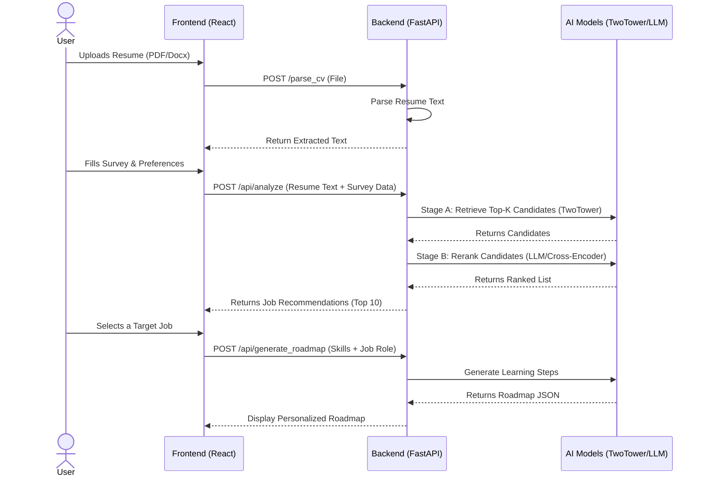

# Career Roadmapper

This repository hosts the backend and AI models for a Career Roadmapper, a system designed to match candidates with jobs using a Two-Tower embedding model and LLM-based reranking.

## Components
- **FastAPI Backend**: `app.py` servces as the main entry point, handling model predictions and resume parsing.
- **Frontend**: A React/Vite application located in the `frontend/` directory.
- **AI Models**:
  - **Stage A**: Two-Tower Model (BERT-based) for retrieving top candidates.
  - **Stage B**: Cross-Encoder / LLM Reranker for fine-grained selection.

## Architecture & Flow

The following sequence diagram illustrates how the Frontend interacts with the Backend services:



## Deployment Guide

### Prerequisites
- **Python**: Version 3.9 or higher.
- **Node.js**: Version 16 or higher (for frontend).
- **OpenAI API Key**: Required if using LLM features (set `OPENAI_API_KEY` environment variable).
- **DeepSeek API Key** (Optional): Preferred for roadmap generation (set `DEEPSEEK_API_KEY`). Falls back to OpenAI if not provided.

### 1. Backend Setup

The backend is built with FastAPI.

1.  **Navigate to the root directory**:
    ```bash
    cd career-roadmapper
    ```

2.  **Create a Virtual Environment** (Recommended):
    ```bash
    python -m venv venv
    # Windows
    venv\Scripts\activate
    # Mac/Linux
    source venv/bin/activate
    ```

3.  **Install Dependencies**:
    ```bash
    pip install -r backend/requirements.txt
    ```
    *Note: Ensure `backend/requirements.txt` exists. If dependencies are missing, install `fastapi`, `uvicorn`, `torch`, `transformers`, `pandas`, `numpy`, `openai`, `python-multipart` as needed.*

4.  **Set Environment Variables**:

    **Windows (PowerShell)**:
    ```powershell
    $env:OPENAI_API_KEY="your-api-key-here"
    $env:DEEPSEEK_API_KEY="your-deepseek-key-here"
    $env:ART_DIR="artifacts"
    ```

    **Windows (Command Prompt)**:
    ```cmd
    set OPENAI_API_KEY=your-api-key-here
    set DEEPSEEK_API_KEY=your-deepseek-key-here
    set ART_DIR=artifacts
    ```

    **Linux / macOS / Git Bash**:
    ```bash
    export OPENAI_API_KEY="your-api-key-here"
    export DEEPSEEK_API_KEY="your-deepseek-key-here"
    export ART_DIR="artifacts"
    ```

    > [!TIP]
    > You can also create a `.env` file in the root directory. If you install `python-dotenv`, these variables can be loaded automatically!


5.  **Run the Server**:
    ```bash
    uvicorn app:app --host 0.0.0.0 --port 8000
    ```
    The API will be live at `http://localhost:8000`.

### 2. Frontend Setup

The frontend is a Vite + React application.

1.  **Navigate to the frontend directory**:
    ```bash
    cd frontend
    ```

2.  **Install Dependencies**:
    ```bash
    npm install
    ```

3.  **Build for Production**:
    ```bash
    npm run build
    ```
    This creates a `dist` folder with static assets.

4.  **Preview Production Build locally**:
    ```bash
    npm run preview
    ```
    Or run in development mode:
    ```bash
    npm run dev
    ```

### 3. Production Deployment Notes

For a full production deployment:
*   **Backend**: Use a process manager like `gunicorn` with `uvicorn` workers, or deploy as a Docker container.
*   **Frontend**: Serve the `frontend/dist` static files using Nginx, Vercel, or Netlify.
*   **Reverse Proxy**: Configure Nginx (or similar) to route API requests (e.g., `/api`) to the backend and serve the frontend assets for other routes.

## Directory Structure
- `app.py`: Main API entry point.
- `backend/`: Core logic for resume parsing, roadmap generation, and model utilities.
- `frontend/`: React application source code.
- `artifacts/`: Directory for model weights and configuration files.
- `data/`: Dataset storage (e.g., `jobs.csv`).
